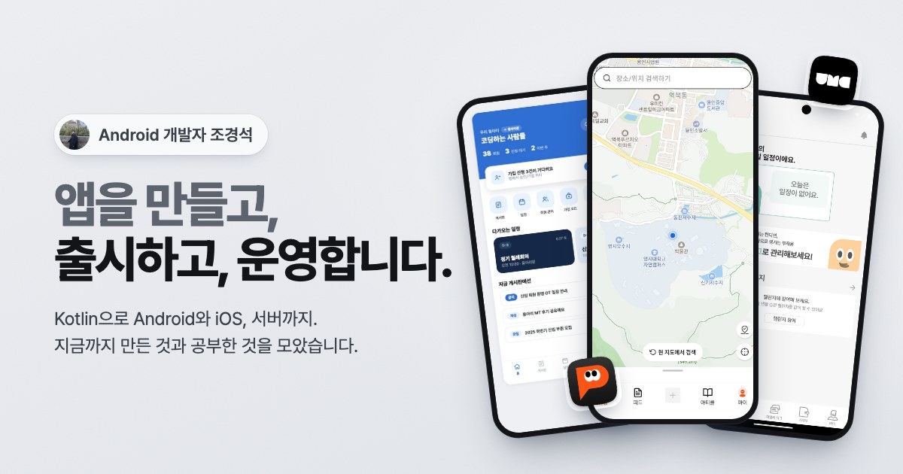
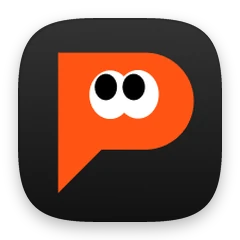
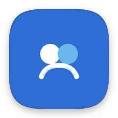
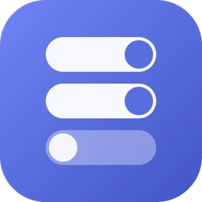
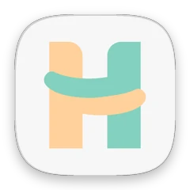
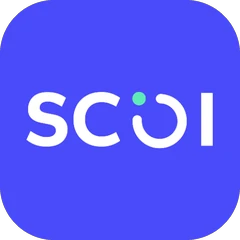
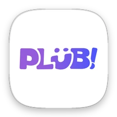
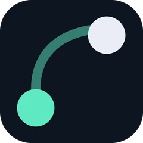

 
 

# 조경석

**Android 개발자** 
앱을 만들고, 출시하고, 운영합니다.

 

 

## 둘러보기

| | |
|---|---|
| [**만든 것**](https://gyeongseok.vercel.app/projects) | 팀으로 출시한 앱부터 혼자 만든 도구, 외주 작업까지 |
| [**공부한 것**](https://gyeongseok.vercel.app/study) | Notion과 GitHub에 정리해 온 공부 기록 |
| [**소개**](https://gyeongseok.vercel.app/about) | 학력, 활동, 수상, 다루는 기술 |

 

## 대표 프로젝트

<table>
  <tr>
    <td align="center" width="20%">
       
      <b>핀유트</b> 
      지인이 다녀온 곳만 모아 보는 지도 SNS
    </td>
    <td align="center" width="20%">
       
      <b>UMC 운영 앱</b> 
      전국 28개 대학 IT 동아리 운영 앱
    </td>
    <td align="center" width="20%">
       
      <b>다모임</b> 
      기획부터 서버까지 혼자 만든 동아리 운영 앱
    </td>
    <td align="center" width="20%">
       
      <b>포스크탑</b> 
      바탕화면을 걸어다니는 포켓몬 게임
    </td>
    <td align="center" width="20%">
       
      <b>스위치보드</b> 
      Android 원격 설정 편집 데스크톱 앱
    </td>
  </tr>
</table>

&nbsp;
&nbsp;
&nbsp;
&nbsp;

그 밖의 프로젝트는 <a href="https://gyeongseok.vercel.app/projects">사이트</a>에서 볼 수 있어요.

 

© 2026 조경석. 이 저장소는 <a href="https://gyeongseok.vercel.app">gyeongseok.vercel.app</a>의 소스입니다.

